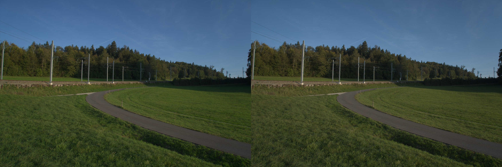

# G4 — decoder oracle

**Verdict: PASS (2026-09-05).**

`wb oracle <id>` decoded the committed A7C II fixture independently through its full embedded JPEG,
Core Image RAW, and LibRaw. All three outputs were `1752×1168`, orientation-applied, linear Rec.2020
frames at quarter scale; the tool refuses to resize unequal frames into apparent agreement.

The CIRAW-to-LibRaw comparison averaged each decoder over the same 64×64 source-space patch grid.
It excluded no patches under the rule “either decoder Y > 0.9” and measured mean ΔE00 `1.927` and
p95 ΔE00 `2.791`, passing the fixed limits of `2.0` and `5.0`. The exact rerunnable path is covered by
`test/macos/decoder-oracle.test.ts`; its JSON evidence is produced beside the workbench report.

The first run failed honestly at mean `4.723`, p95 `5.665`. That failure revealed that Core Image's
per-file `baselineExposure`, `shadowBias`, and local tone-map defaults were still active even though
the documented enhancement controls were zero. Explicitly neutralizing every RAW presentation
control brought the independent decoders inside the contract without changing its tolerance.

The full embedded JPEG remains deliberately brighter and more contrasty: it is the camera's rendered
preview, so it is included as framing/context evidence but not treated as a neutral RAW oracle.

The visual comparison measured CIRAW-to-LibRaw grayscale MAE `3.358`, a `0.112%` pixelmatch ratio,
and an edge-energy ratio of `1.133`; only `0.004%` of pixels differed by more than 32 luminance levels.
A fresh reviewer given the complete full-frame and zoom-crop set found identical landmarks and geometry
with no rotation, mirroring, translation, crop loss, or missing content. They judged CIRAW and LibRaw
“comfortably close enough to be alternate neutral RAW decodes,” noting only mild crop-scale color
fringing and small warmth/edge differences. The embedded preview was correctly identified as brighter,
more saturated, and more contrasty. The non-blocking checkpoint therefore accepts the G4 result without
recapture or tolerance changes.

The shared native color runtime was exercised through the public file and RAW paths on Darwin ARM64;
the Docker gate also built and loaded the Linux ARM64 package. The root CI gate runs the same build and
tests on `ubuntu-latest`, covering the packaged Linux x64 target. `doctor` reports the selected native
package separately as `native_image`; it is required on supported targets even though npm declares the
mutually exclusive OS/CPU packages as optional dependencies.
The release workflow builds all four supported native packages on matching hosted runners, then
assembles those artifacts before npm publication so the required runtime is never shipped empty.

The async napi boundary snapshots mutable input before worker access. On this host that synchronous
copy measured `2.4 ms` for the fixture's 11.7 MiB quarter-scale display buffer and `22.3 ms` for its
187.3 MiB full-resolution display buffer; the color transform itself remains on the worker. A mutation
regression test proves the result is fixed at invocation time rather than racing JavaScript writes.
